### Post-Synthesis GLS & STA Fundamentals 

### 🔁 Week 2 Recap — Pre-Synthesis Simulation Flow

Before moving to post-synthesis verification, let’s quickly revisit the pre-synthesis flow we established in Week 2.

```bash
# Clone the VSDBabySoC repository
git clone https://github.com/manili/VSDBabySoC.git
cd VSDBabySoC/

# Set up Python virtual environment and install SandPiper
python3 -m venv venv
source venv/bin/activate
pip install pyyaml click sandpiper-saas

# Convert TL-Verilog to SystemVerilog
sandpiper-saas -i ./src/module/*.tlv -o rvmyth.v --bestsv --noline -p verilog --outdir ./src/module/

# Compile and run pre-synthesis simulation
mkdir -p output/pre_synth_sim
iverilog -o output/pre_synth_sim/pre_synth_sim.out -DPRE_SYNTH_SIM -I src/include -I src/module src/module/testbench.v
cd output/pre_synth_sim/
./pre_synth_sim.out
gtkwave pre_synth_sim.vcd
```

**Result:**

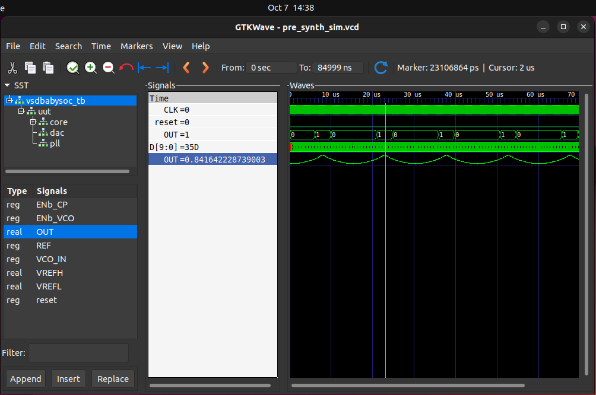

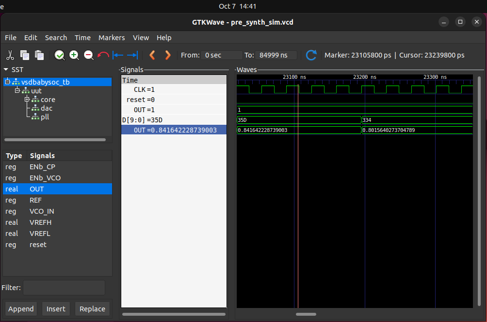

* ✅ Functional verification of the BabySoC RTL using TL-Verilog to Verilog conversion.
* ✅ Waveform visualization of key signals (`CLK`, `reset`, `OUT`, `RV_TO_DAC[9:0]`).
* ✅ Verified that the pre-synthesis simulation produces the correct digital behavior.

---

Next, in **Week 3**, we’ll extend this flow to include:

* **Post-Synthesis Gate-Level Simulation (GLS)** using the synthesized netlist.
* **Static Timing Analysis (STA)** using **OpenSTA** to explore setup/hold checks, slack, and critical-path timing.

---

## 🧩 Week 3 – Part 1: Post-Synthesis GLS (Functional Validation)

### 🎯 Objective

To perform **Gate-Level Simulation (GLS)** on the synthesized `vsdbabysoc` design using the Sky130 HD standard-cell library and validate that the post-synthesis output matches the pre-synthesis functional simulation.

---

### ⚙️ Directory Structure

```
VSDBabySoC/
├── src/
│   ├── module/
│   │   ├── vsdbabysoc.v
│   │   ├── rvmyth.v
│   │   ├── clk_gate.v
│   │   ├── avsddac.v
│   │   ├── avsdpll.v
│   │   ├── pseudo_rand.sv
│   │   ├── pseudo_rand_gen.sv
│   │   ├── testbench.v
│   │   ├── sky130_fd_sc_hd.v
│   │   └── primitives.v
│   └── include/
├── output/
│   ├── pre_synth_sim/
│   │   ├── pre_synth_sim.out
│   │   └── pre_synth_sim.vcd
│   ├── synthesis/
│   │   └── vsdbabysoc.synth.v
│   └── post_synth_sim/
└── ...
```

---

### 🧱 1. Logic Synthesis using Yosys

**Goal:** Generate a gate-level netlist mapped to Sky130 HD cells.

#### 🔧 Commands

From the project root (`~/Soc/3/VSDBabySoC/`):

```bash
yosys
```

Inside Yosys shell:

```tcl
# Read design files
read_verilog src/module/vsdbabysoc.v
read_verilog -I src/include/ src/module/rvmyth.v
read_verilog -I src/include/ src/module/clk_gate.v
read_verilog -sv src/module/avsddac.v
read_verilog -sv src/module/avsdpll.v
read_verilog -sv src/module/pseudo_rand.sv
read_verilog -sv src/module/pseudo_rand_gen.sv
```

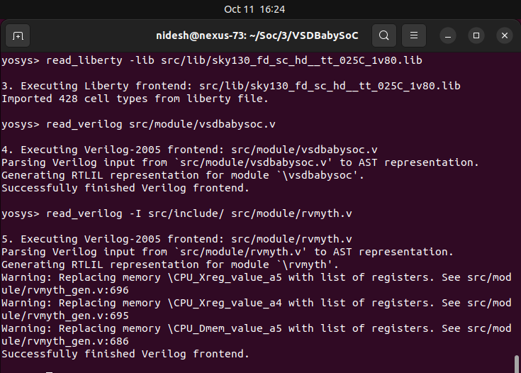
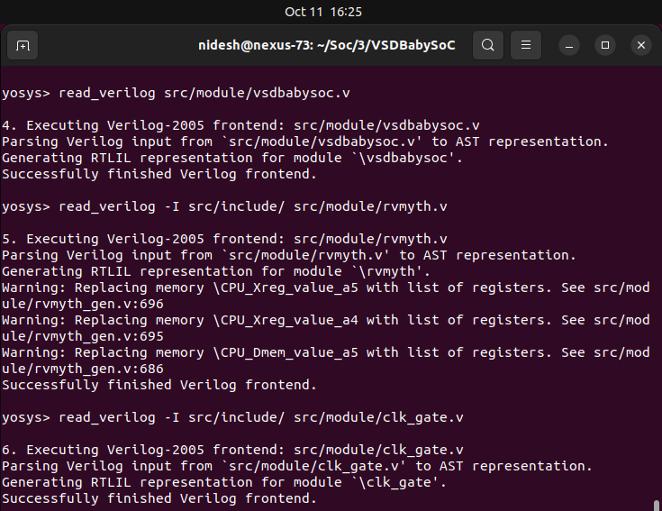

```tcl
# Read standard-cell and IP Liberty files
read_liberty -lib src/lib/sky130_fd_sc_hd__tt_025C_1v80.lib
read_liberty -lib src/lib/avsddac.lib
read_liberty -lib src/lib/avsdpll.lib
```
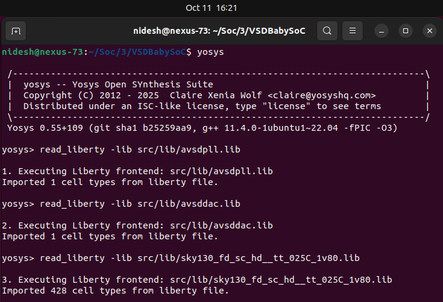

```tcl
# Synthesize the top module
synth -top vsdbabysoc
```
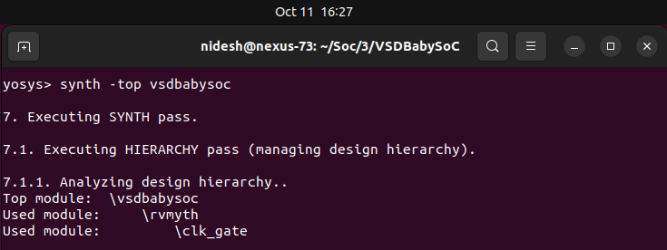

### Synthesis Statistics :

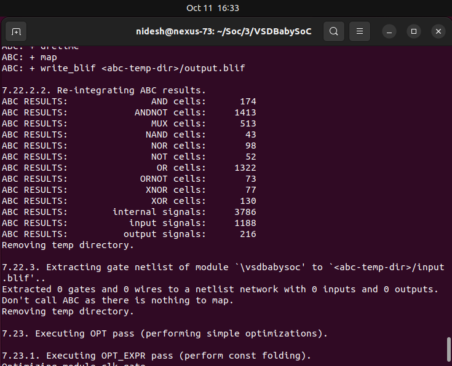

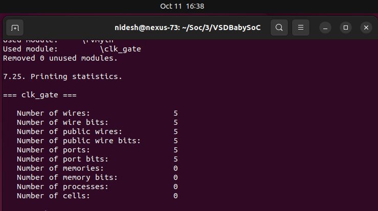

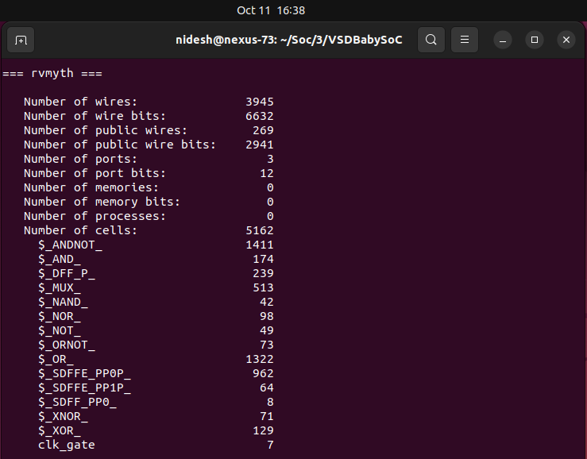

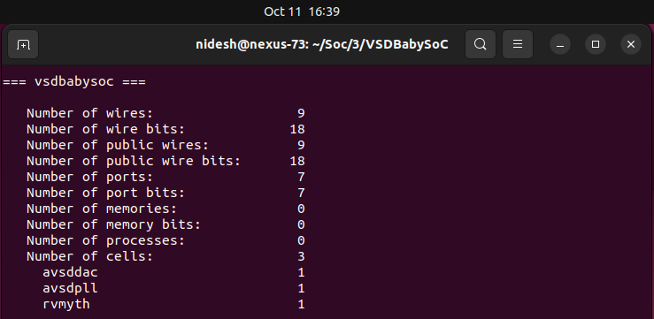

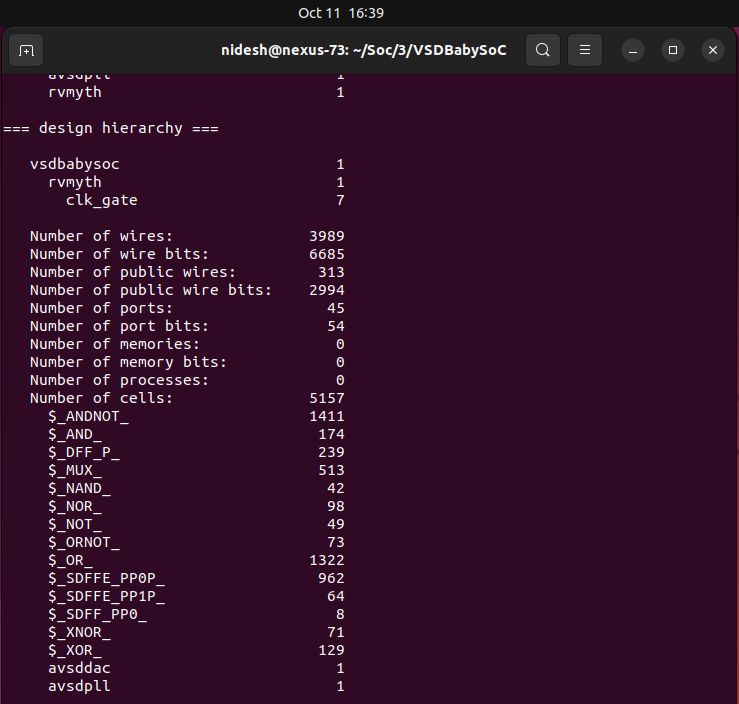

```tcl
# Map D-flip-flops and perform optimization
dfflibmap -liberty src/lib/sky130_fd_sc_hd__tt_025C_1v80.lib
opt
abc -liberty src/lib/sky130_fd_sc_hd__tt_025C_1v80.lib
```
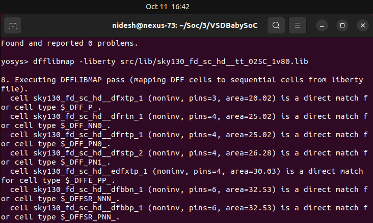

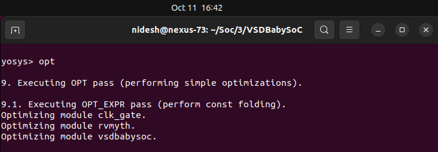

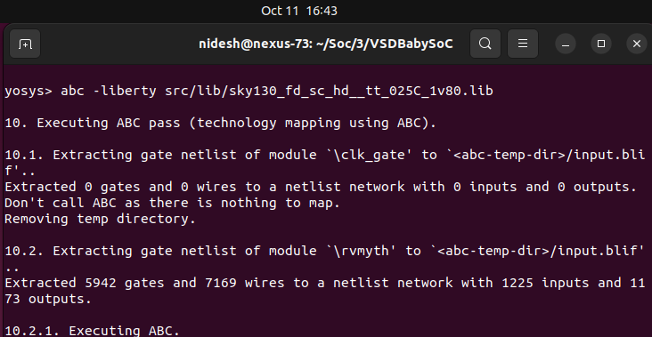

```tcl
# Cleanup and finalize
flatten
setundef -zero
clean -purge
rename -enumerate

# View synthesis statistics
stat

# Write synthesized netlist
write_verilog -noattr output/synthesis/vsdbabysoc.synth.v
```


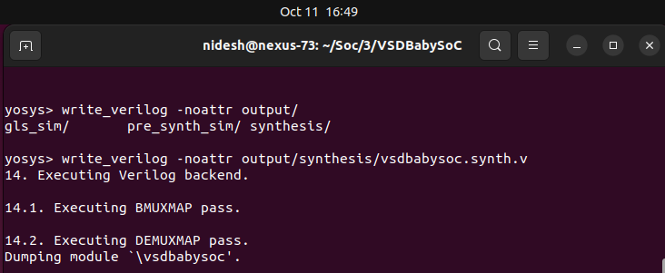


---

### 📊 2. Yosys Synthesis Statistics

| Metric                                | Value                                 |
| :------------------------------------ | :------------------------------------ |
| Total Cells                           | **5238**                              |
| Flip-Flops (sky130_fd_sc_hd__dfxtp_1) | 1144                                  |
| NAND2 Gates                           | 1251                                  |
| NOR2 Gates                            | 516                                   |
| MUX2 Cells                            | 5                                     |
| Hierarchical Modules                  | vsdbabysoc, rvmyth, clk_gate          |
| Standard Cells Used                   | Sky130 HD Library                     |
| Netlist File                          | `output/synthesis/vsdbabysoc.synth.v` |

---

### 🧩 3. Gate-Level Simulation (GLS)

**Purpose:**
Verify that the synthesized gate-level netlist behaves identically to the RTL functional simulation.

#### 📦 Setup

Copy required standard-cell Verilog models:

```bash
cp ~/Soc/3/sky130RTLDesignAndSynthesisWorkshop/my_lib/verilog_model/sky130_fd_sc_hd.v src/module/
cp ~/Soc/3/sky130RTLDesignAndSynthesisWorkshop/my_lib/verilog_model/primitives.v src/module/
```
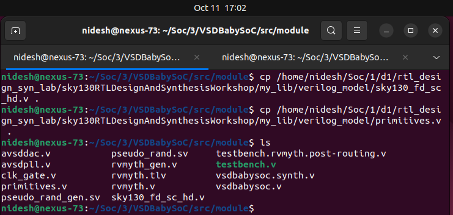


#### ▶️ Compile & Run

```bash
# Compile gate-level simulation
iverilog -o output/post_synth_sim/post_synth_sim.out \
  -DPOST_SYNTH_SIM -DFUNCTIONAL -DUNIT_DELAY=#1 \
  -I src/include -I src/module \
  src/module/testbench.v

# Run simulation
cd output/post_synth_sim
./post_synth_sim.out
```
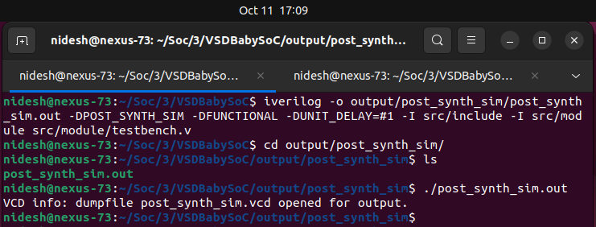

#### 📈 Waveform Viewing

```bash
gtkwave post_synth_sim.vcd
```
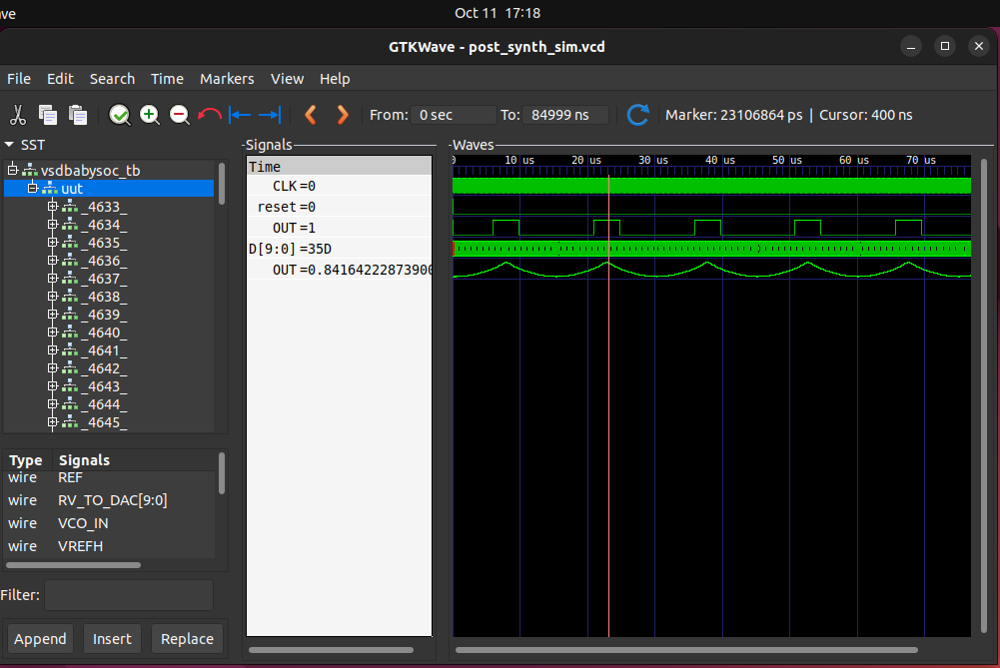

---

### 📋 4. Verification Summary

| Checkpoint            | Description                    |            Result            |
| :-------------------- | :----------------------------- | :--------------------------: |
| Functional Simulation | RTL-level waveform from Week 2 |               ✅              |
| Gate-Level Simulation | Post-synthesis waveform        |               ✅              |
| Comparison            | Outputs matched bit-by-bit     | ✅ (GLS = Functional Outputs) |

---

### 📎 Deliverables

| File / Log                          | Location                                   |
| :---------------------------------- | :----------------------------------------- |
| Synthesized Netlist                 | `output/synthesis/vsdbabysoc.synth.v`      |
| Synthesis Log (Saved from Terminal) | `output/synthesis/yosys_synth.log`         |
| GLS Executable                      | `output/post_synth_sim/post_synth_sim.out` |
| GLS Waveform                        | `output/post_synth_sim/post_synth_sim.vcd` |
| Comparison Note                     | `docs/week3_gls_report.md`                 |

---

### 🧠 Conclusion

Successful **post-synthesis GLS** confirms that synthesis preserved design functionality.
Next, we’ll proceed to **Week 3 – Part 2: Static Timing Analysis (STA) using OpenSTA** to explore timing closure and critical path analysis.

---

# ⏱️ **Week 3 — Static Timing Analysis (STA) using OpenSTA**

---

## 🧩 **Overview**

**Static Timing Analysis (STA)** is a **method to verify timing performance** of a digital design **without simulation**.
It ensures that **all signal paths meet setup and hold requirements**, allowing the circuit to operate correctly at the target clock frequency.

Unlike dynamic simulation, STA checks **every possible path** between registers and I/O ports — providing **complete timing coverage**.

---

## ⚙️ **Why STA?**

| Feature              | Static Timing Analysis      | Dynamic Timing Simulation |
| :------------------- | :-------------------------- | :------------------------ |
| 🔍 **Input Vectors** | Not required                | Required                  |
| ⚡ **Speed**          | Very Fast                   | Slow                      |
| 🧮 **Coverage**      | All paths                   | Limited to test vectors   |
| 🧠 **Purpose**       | Timing correctness          | Functional + Timing       |
| 🔄 **Stage**         | Post-synthesis, post-layout | Functional verification   |

---

## 🕒 **Timing Path Components**

A **timing path** represents the journey of a signal from one timing point to another.

| Path Type               | Example                               | Description                  |
| :---------------------- | :------------------------------------ | :--------------------------- |
| **Input → Register**    | External signal captured in flip-flop | Input synchronization        |
| **Register → Register** | Q → D of two flops                    | Data transfer inside chip    |
| **Register → Output**   | Flop output to pad                    | Output timing check          |
| **Input → Output**      | Pure combinational logic              | Used for path delay analysis |

<p align="center">
  
</p>

---

## 🧮 **Clock Definitions**

A **clock** defines the timing reference for all sequential elements in a circuit.

| Parameter                | Meaning                                            |
| :----------------------- | :------------------------------------------------- |
| ⏰ **Clock Period**       | Time between consecutive rising (or falling) edges |
| 🔁 **Duty Cycle**        | Ratio of high time to total period                 |
| ⚙️ **Clock Latency**     | Delay from clock source to register                |
| ⚖️ **Clock Uncertainty** | Models jitter/skew margin                          |
| 🕹️ **Generated Clocks** | Derived clocks for gated/divided paths             |

```tcl
create_clock -name clk -period 10 [get_ports clk]
set_clock_uncertainty 0.2 [get_clocks clk]
```

---

## 📈 **Setup and Hold Time Checks**

| Check             | Requirement                                  | Violation Cause            |
| :---------------- | :------------------------------------------- | :------------------------- |
| **Setup Time** ⏱️ | Data must arrive **before** clock edge       | Data arrives too **late**  |
| **Hold Time** 🧲  | Data must remain stable **after** clock edge | Data changes too **early** |

<p align="center">
  
</p>

✅ Meeting both setup and hold ensures **stable flip-flop operation** and prevents **metastability**.

---

## 📊 **Slack — The Timing Margin**

**Slack** represents the **difference between required and actual timing**.
It tells whether a path meets timing or violates it.

| Type            | Formula            | Interpretation                       |
| :-------------- | :----------------- | :----------------------------------- |
| **Setup Slack** | Required − Arrival | ⏱️ > 0 → Safe, < 0 → Setup violation |
| **Hold Slack**  | Arrival − Required | ⚙️ > 0 → Safe, < 0 → Hold violation  |

| Slack Type            | Meaning       | Action       |
| :-------------------- | :------------ | :----------- |
| 🟢 **Positive Slack** | Meets timing  | ✅ OK         |
| 🟡 **Zero Slack**     | Critical path | ⚠️ Monitor   |
| 🔴 **Negative Slack** | Violation     | ❌ Fix needed |

---

## 🧭 **Path-Based Analysis**

STA analyzes **each timing path** from:

* **Startpoint** → Launch clock edge
* **Endpoint** → Capture clock edge

Example of a **setup check** path:

```
Launch FF (Q) → Combinational Logic → Capture FF (D)
```

Each segment contributes:

* **Cell Delay** (gate delay)
* **Net Delay** (wire delay)

The total of these delays gives **Data Arrival Time**, which is compared against **Data Required Time**.

---

## 📐 **Key Terms**

| Term                         | Description                                     |
| :--------------------------- | :---------------------------------------------- |
| **Startpoint**               | Source of signal (e.g., register/Q, input port) |
| **Endpoint**                 | Destination (e.g., register/D, output port)     |
| **Data Arrival Time (DAT)**  | Time signal reaches endpoint                    |
| **Data Required Time (DRT)** | Latest time signal must arrive                  |
| **Slack**                    | DRT − DAT                                       |
| **Critical Path**            | Path with least (most negative) slack           |

---

## 🔎 **Exception Handling**

| Command                           | Purpose                                    |
| :-------------------------------- | :----------------------------------------- |
| `set_false_path`                  | Ignores invalid/unrelated timing paths     |
| `set_multicycle_path`             | Allows multiple cycles for path completion |
| `set_max_delay` / `set_min_delay` | Custom path delay constraints              |

---

## 📄 **Example OpenSTA Commands**

```tcl
read_liberty sky130_fd_sc_hd__tt_025C_1v80.lib
read_verilog vsdbabysoc.synth.v
link_design vsdbabysoc
read_sdc constraints.sdc

report_checks -path_delay min_max
report_clocks
report_tns
report_wns
```

---

## 🧾 **Interpretation of Reports**

| Report          | Description                                     |
| :-------------- | :---------------------------------------------- |
| `report_clocks` | Lists defined clocks, period, skew, and latency |
| `report_checks` | Displays setup/hold timing violations           |
| `report_tns`    | Total Negative Slack — overall violation        |
| `report_wns`    | Worst Negative Slack — worst violating path     |

🟢 *All positive or zero slack → Design is timing clean*
🔴 *Negative slack → Requires fixing via optimization or constraint tuning*

---

## 🧠 **Key Takeaways**

* STA verifies **timing correctness** at **gate-level**.
* It ensures all **setup and hold checks** pass across paths.
* **Slack** quantifies design timing margin.
* **Clock constraints** define the temporal behavior of the design.
* OpenSTA provides **fast, exhaustive timing verification** after synthesis or P&R.

---

<p align="center">
  
</p>

> 🧾 *“If logic defines what a circuit does, timing defines **when** it does it — STA ensures both happen reliably.”*

---

