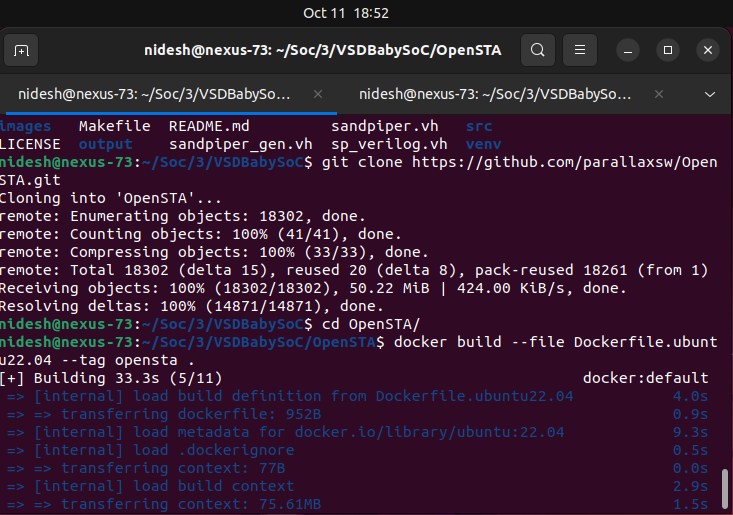
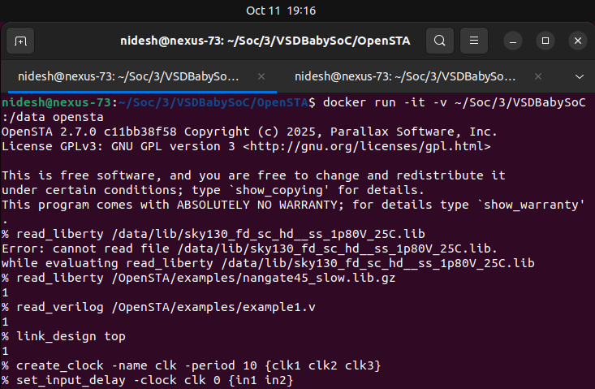
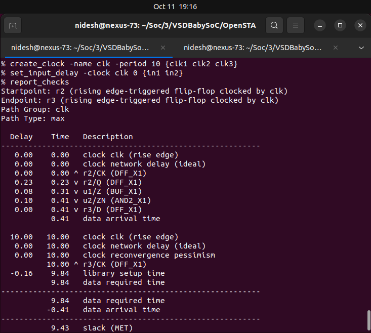
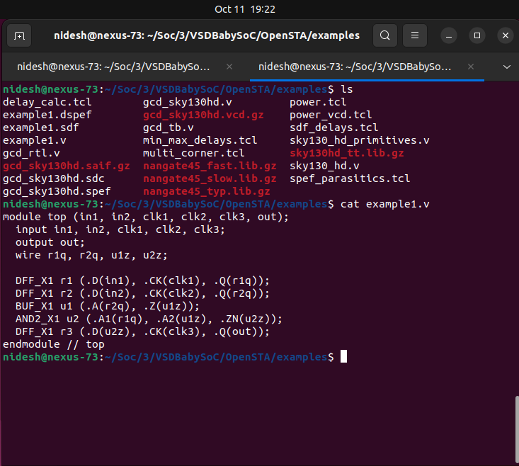
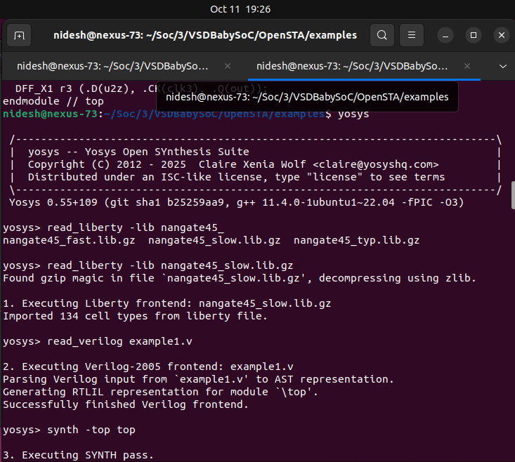
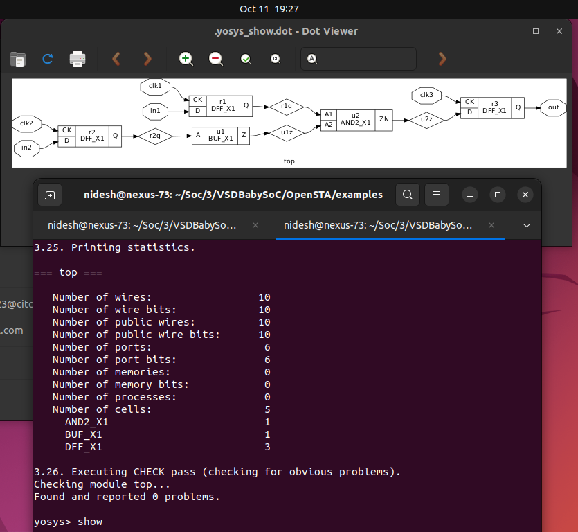
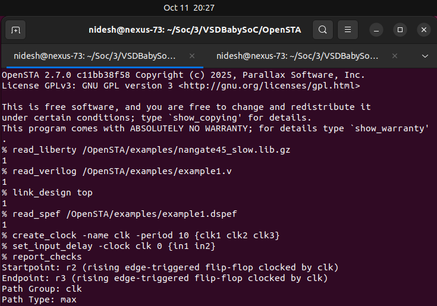
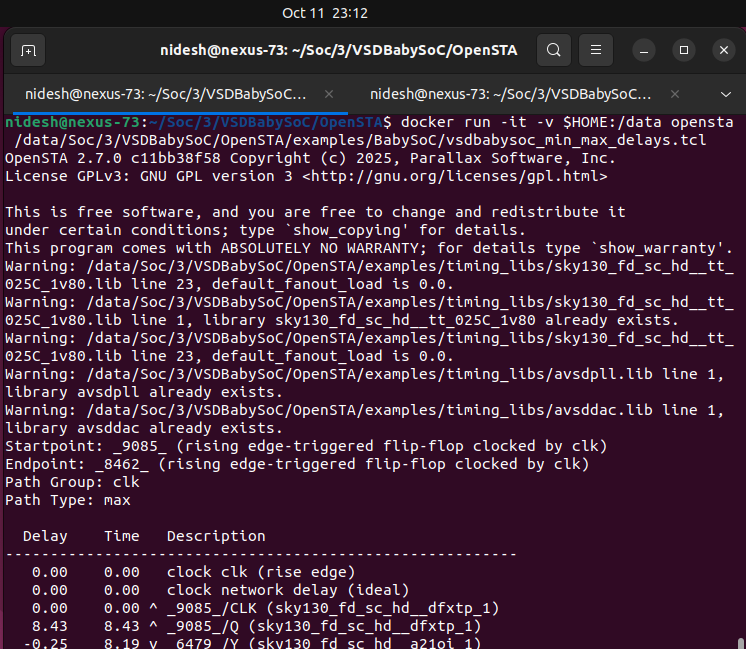
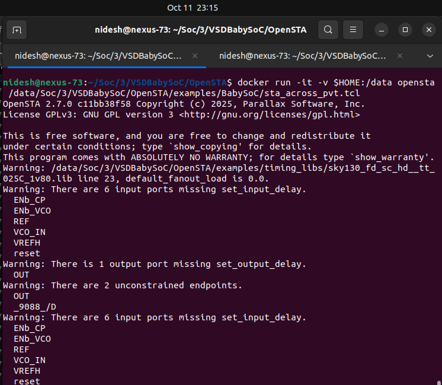
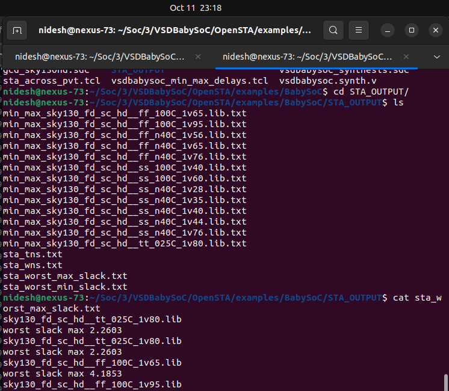

### Post-Synthesis GLS & STA Fundamentals 

### 🔁 Week 2 Recap — Pre-Synthesis Simulation Flow

Before moving to post-synthesis verification, let’s quickly revisit the pre-synthesis flow we established in Week 2.

```bash
# Clone the VSDBabySoC repository
git clone https://github.com/manili/VSDBabySoC.git
cd VSDBabySoC/

# Set up Python virtual environment and install SandPiper
python3 -m venv venv
source venv/bin/activate
pip install pyyaml click sandpiper-saas

# Convert TL-Verilog to SystemVerilog
sandpiper-saas -i ./src/module/*.tlv -o rvmyth.v --bestsv --noline -p verilog --outdir ./src/module/

# Compile and run pre-synthesis simulation
mkdir -p output/pre_synth_sim
iverilog -o output/pre_synth_sim/pre_synth_sim.out -DPRE_SYNTH_SIM -I src/include -I src/module src/module/testbench.v
cd output/pre_synth_sim/
./pre_synth_sim.out
gtkwave pre_synth_sim.vcd
```

**Result:**


* ✅ Functional verification of the BabySoC RTL using TL-Verilog to Verilog conversion.
* ✅ Waveform visualization of key signals (`CLK`, `reset`, `OUT`, `RV_TO_DAC[9:0]`).
* ✅ Verified that the pre-synthesis simulation produces the correct digital behavior.

---

Next, in **Week 3**, we’ll extend this flow to include:

* **Post-Synthesis Gate-Level Simulation (GLS)** using the synthesized netlist.
* **Static Timing Analysis (STA)** using **OpenSTA** to explore setup/hold checks, slack, and critical-path timing.

---

## 🧩 Week 3 – Part 1: Post-Synthesis GLS (Functional Validation)

### 🎯 Objective

To perform **Gate-Level Simulation (GLS)** on the synthesized `vsdbabysoc` design using the Sky130 HD standard-cell library and validate that the post-synthesis output matches the pre-synthesis functional simulation.

---

### ⚙️ Directory Structure

```
VSDBabySoC/
├── src/
│   ├── module/
│   │   ├── vsdbabysoc.v
│   │   ├── rvmyth.v
│   │   ├── clk_gate.v
│   │   ├── avsddac.v
│   │   ├── avsdpll.v
│   │   ├── pseudo_rand.sv
│   │   ├── pseudo_rand_gen.sv
│   │   ├── testbench.v
│   │   ├── sky130_fd_sc_hd.v
│   │   └── primitives.v
│   └── include/
├── output/
│   ├── pre_synth_sim/
│   │   ├── pre_synth_sim.out
│   │   └── pre_synth_sim.vcd
│   ├── synthesis/
│   │   └── vsdbabysoc.synth.v
│   └── post_synth_sim/
└── ...
```

---

### 🧱 1. Logic Synthesis using Yosys

**Goal:** Generate a gate-level netlist mapped to Sky130 HD cells.

#### 🔧 Commands

From the project root (`~/Soc/3/VSDBabySoC/`):

```bash
yosys
```

Inside Yosys shell:

```tcl
# Read design files
read_verilog src/module/vsdbabysoc.v
read_verilog -I src/include/ src/module/rvmyth.v
read_verilog -I src/include/ src/module/clk_gate.v
read_verilog -sv src/module/avsddac.v
read_verilog -sv src/module/avsdpll.v
read_verilog -sv src/module/pseudo_rand.sv
read_verilog -sv src/module/pseudo_rand_gen.sv
```


```tcl
# Read standard-cell and IP Liberty files
read_liberty -lib src/lib/sky130_fd_sc_hd__tt_025C_1v80.lib
read_liberty -lib src/lib/avsddac.lib
read_liberty -lib src/lib/avsdpll.lib
```


```tcl
# Synthesize the top module
synth -top vsdbabysoc
```


### Synthesis Statistics :


```tcl
# Map D-flip-flops and perform optimization
dfflibmap -liberty src/lib/sky130_fd_sc_hd__tt_025C_1v80.lib
opt
abc -liberty src/lib/sky130_fd_sc_hd__tt_025C_1v80.lib
```


```tcl
# Cleanup and finalize
flatten
setundef -zero
clean -purge
rename -enumerate

# View synthesis statistics
stat

# Write synthesized netlist
write_verilog -noattr output/synthesis/vsdbabysoc.synth.v
```


---

### 📊 2. Yosys Synthesis Statistics

| Metric                                | Value                                 |
| :------------------------------------ | :------------------------------------ |
| Total Cells                           | **5238**                              |
| Flip-Flops (sky130_fd_sc_hd__dfxtp_1) | 1144                                  |
| NAND2 Gates                           | 1251                                  |
| NOR2 Gates                            | 516                                   |
| MUX2 Cells                            | 5                                     |
| Hierarchical Modules                  | vsdbabysoc, rvmyth, clk_gate          |
| Standard Cells Used                   | Sky130 HD Library                     |
| Netlist File                          | `output/synthesis/vsdbabysoc.synth.v` |

---

### 🧩 3. Gate-Level Simulation (GLS)

**Purpose:**
Verify that the synthesized gate-level netlist behaves identically to the RTL functional simulation.

#### 📦 Setup

Copy required standard-cell Verilog models:

```bash
cp ~/Soc/3/sky130RTLDesignAndSynthesisWorkshop/my_lib/verilog_model/sky130_fd_sc_hd.v src/module/
cp ~/Soc/3/sky130RTLDesignAndSynthesisWorkshop/my_lib/verilog_model/primitives.v src/module/
```


#### ▶️ Compile & Run

```bash
# Compile gate-level simulation
iverilog -o output/post_synth_sim/post_synth_sim.out \
  -DPOST_SYNTH_SIM -DFUNCTIONAL -DUNIT_DELAY=#1 \
  -I src/include -I src/module \
  src/module/testbench.v

# Run simulation
cd output/post_synth_sim
./post_synth_sim.out
```


#### 📈 Waveform Viewing

```bash
gtkwave post_synth_sim.vcd
```


---

### 📋 4. Verification Summary

| Checkpoint            | Description                    |            Result            |
| :-------------------- | :----------------------------- | :--------------------------: |
| Functional Simulation | RTL-level waveform from Week 2 |               ✅              |
| Gate-Level Simulation | Post-synthesis waveform        |               ✅              |
| Comparison            | Outputs matched bit-by-bit     | ✅ (GLS = Functional Outputs) |

---

### 📎 Deliverables

| File / Log                          | Location                                   |
| :---------------------------------- | :----------------------------------------- |
| Synthesized Netlist                 | `output/synthesis/vsdbabysoc.synth.v`      |
| Synthesis Log (Saved from Terminal) | `output/synthesis/yosys_synth.log`         |
| GLS Executable                      | `output/post_synth_sim/post_synth_sim.out` |
| GLS Waveform                        | `output/post_synth_sim/post_synth_sim.vcd` |
| Comparison Note                     | `docs/week3_gls_report.md`                 |

---

### 🧠 Conclusion

Successful **post-synthesis GLS** confirms that synthesis preserved design functionality.
Next, we’ll proceed to **Week 3 – Part 2: Static Timing Analysis (STA) using OpenSTA** to explore timing closure and critical path analysis.

---

# ⏱️ **Week 3 — Static Timing Analysis (STA) using OpenSTA**

---

## 🧩 **Overview**

**Static Timing Analysis (STA)** is a **method to verify timing performance** of a digital design **without simulation**.
It ensures that **all signal paths meet setup and hold requirements**, allowing the circuit to operate correctly at the target clock frequency.

Unlike dynamic simulation, STA checks **every possible path** between registers and I/O ports — providing **complete timing coverage**.

---

## ⚙️ **Why STA?**

| Feature              | Static Timing Analysis      | Dynamic Timing Simulation |
| :------------------- | :-------------------------- | :------------------------ |
| 🔍 **Input Vectors** | Not required                | Required                  |
| ⚡ **Speed**          | Very Fast                   | Slow                      |
| 🧮 **Coverage**      | All paths                   | Limited to test vectors   |
| 🧠 **Purpose**       | Timing correctness          | Functional + Timing       |
| 🔄 **Stage**         | Post-synthesis, post-layout | Functional verification   |

---

## 🕒 **Timing Path Components**

A **timing path** represents the journey of a signal from one timing point to another.

| Path Type               | Example                               | Description                  |
| :---------------------- | :------------------------------------ | :--------------------------- |
| **Input → Register**    | External signal captured in flip-flop | Input synchronization        |
| **Register → Register** | Q → D of two flops                    | Data transfer inside chip    |
| **Register → Output**   | Flop output to pad                    | Output timing check          |
| **Input → Output**      | Pure combinational logic              | Used for path delay analysis |

---

## 🧮 **Clock Definitions**

A **clock** defines the timing reference for all sequential elements in a circuit.

| Parameter                | Meaning                                            |
| :----------------------- | :------------------------------------------------- |
| ⏰ **Clock Period**       | Time between consecutive rising (or falling) edges |
| 🔁 **Duty Cycle**        | Ratio of high time to total period                 |
| ⚙️ **Clock Latency**     | Delay from clock source to register                |
| ⚖️ **Clock Uncertainty** | Models jitter/skew margin                          |
| 🕹️ **Generated Clocks** | Derived clocks for gated/divided paths             |

```tcl
create_clock -name clk -period 10 [get_ports clk]
set_clock_uncertainty 0.2 [get_clocks clk]
```

---

## 📈 **Setup and Hold Time Checks**

| Check             | Requirement                                  | Violation Cause            |
| :---------------- | :------------------------------------------- | :------------------------- |
| **Setup Time** ⏱️ | Data must arrive **before** clock edge       | Data arrives too **late**  |
| **Hold Time** 🧲  | Data must remain stable **after** clock edge | Data changes too **early** |


✅ Meeting both setup and hold ensures **stable flip-flop operation** and prevents **metastability**.

---

## 📊 **Slack — The Timing Margin**

**Slack** represents the **difference between required and actual timing**.
It tells whether a path meets timing or violates it.

| Type            | Formula            | Interpretation                       |
| :-------------- | :----------------- | :----------------------------------- |
| **Setup Slack** | Required − Arrival | ⏱️ > 0 → Safe, < 0 → Setup violation |
| **Hold Slack**  | Arrival − Required | ⚙️ > 0 → Safe, < 0 → Hold violation  |

| Slack Type            | Meaning       | Action       |
| :-------------------- | :------------ | :----------- |
| 🟢 **Positive Slack** | Meets timing  | ✅ OK         |
| 🟡 **Zero Slack**     | Critical path | ⚠️ Monitor   |
| 🔴 **Negative Slack** | Violation     | ❌ Fix needed |

---

## 🧭 **Path-Based Analysis**

STA analyzes **each timing path** from:

* **Startpoint** → Launch clock edge
* **Endpoint** → Capture clock edge

Example of a **setup check** path:

```
Launch FF (Q) → Combinational Logic → Capture FF (D)
```

Each segment contributes:

* **Cell Delay** (gate delay)
* **Net Delay** (wire delay)

The total of these delays gives **Data Arrival Time**, which is compared against **Data Required Time**.

---

## 📐 **Key Terms**

| Term                         | Description                                     |
| :--------------------------- | :---------------------------------------------- |
| **Startpoint**               | Source of signal (e.g., register/Q, input port) |
| **Endpoint**                 | Destination (e.g., register/D, output port)     |
| **Data Arrival Time (DAT)**  | Time signal reaches endpoint                    |
| **Data Required Time (DRT)** | Latest time signal must arrive                  |
| **Slack**                    | DRT − DAT                                       |
| **Critical Path**            | Path with least (most negative) slack           |

---

## 🔎 **Exception Handling**

| Command                           | Purpose                                    |
| :-------------------------------- | :----------------------------------------- |
| `set_false_path`                  | Ignores invalid/unrelated timing paths     |
| `set_multicycle_path`             | Allows multiple cycles for path completion |
| `set_max_delay` / `set_min_delay` | Custom path delay constraints              |

---

## 📄 **Example OpenSTA Commands**

```tcl
read_liberty sky130_fd_sc_hd__tt_025C_1v80.lib
read_verilog vsdbabysoc.synth.v
link_design vsdbabysoc
read_sdc constraints.sdc

report_checks -path_delay min_max
report_clocks
report_tns
report_wns
```

---

## 🧾 **Interpretation of Reports**

| Report          | Description                                     |
| :-------------- | :---------------------------------------------- |
| `report_clocks` | Lists defined clocks, period, skew, and latency |
| `report_checks` | Displays setup/hold timing violations           |
| `report_tns`    | Total Negative Slack — overall violation        |
| `report_wns`    | Worst Negative Slack — worst violating path     |

🟢 *All positive or zero slack → Design is timing clean*
🔴 *Negative slack → Requires fixing via optimization or constraint tuning*

---

## 🧠 **Key Takeaways**

* STA verifies **timing correctness** at **gate-level**.
* It ensures all **setup and hold checks** pass across paths.
* **Slack** quantifies design timing margin.
* **Clock constraints** define the temporal behavior of the design.
* OpenSTA provides **fast, exhaustive timing verification** after synthesis or P&R.

---

> 🧾 *“If logic defines what a circuit does, timing defines **when** it does it — STA ensures both happen reliably.”*

---


## 🧩 **Part 3: Static Timing Analysis using OpenSTA**

### 🎯 Objective

Perform Static Timing Analysis (STA) for the synthesized **VSDBabySoC** design using **OpenSTA**, verify timing across multiple corners, and extract reports such as worst slack, TNS, and WNS.

---

## ⚙️ **1. Installation of OpenSTA**

> **Note:** Installation steps are adapted from the official OpenSTA repository — [🔗 GitHub Link](https://github.com/parallaxsw/OpenSTA)

### 🪜 Step 1: Clone the Repository

```bash
git clone https://github.com/parallaxsw/OpenSTA.git
cd OpenSTA
```

---

### 🧱 Step 2: Build the Docker Image

```bash
docker build --file Dockerfile.ubuntu22.04 --tag opensta .
```

This creates a Docker image named **opensta** using the Ubuntu 22.04 Dockerfile, installing all necessary dependencies.



---

### 🧩 Step 3: Run the OpenSTA Container

Run OpenSTA in interactive mode with a mounted directory for data:

```bash
docker run -i -v $HOME:/data opensta
```

Once inside, the shell prompt changes to `%`, indicating that OpenSTA is active.



---

## 📊 **2. Quick Timing Analysis (Inline Flow)**

To verify setup and hold paths interactively, execute the following commands inside the OpenSTA shell:

```tcl
read_liberty /OpenSTA/examples/nangate45_slow.lib.gz
read_verilog /OpenSTA/examples/example1.v
link_design top
create_clock -name clk -period 10 {clk1 clk2 clk3}
set_input_delay -clock clk 0 {in1 in2}
report_checks
```




---

### 💡 Observation:

* By default, `report_checks` performs **setup (max delay)** checks.
* To include both **setup and hold**, use:

  ```tcl
  report_checks -path_delay min_max
  ```
* To view only **hold (min delay)** paths:

  ```tcl
  report_checks -path_delay min
  ```

---

## 🔍 **3. Example Design Used: `example1.v`**

```verilog
module top (in1, in2, clk1, clk2, clk3, out);
  input in1, in2, clk1, clk2, clk3;
  output out;
  wire r1q, r2q, u1z, u2z;

  DFF_X1 r1 (.D(in1), .CK(clk1), .Q(r1q));
  DFF_X1 r2 (.D(in2), .CK(clk2), .Q(r2q));
  BUF_X1 u1 (.A(r2q), .Z(u1z));
  AND2_X1 u2 (.A1(r1q), .A2(u1z), .ZN(u2z));
  DFF_X1 r3 (.D(u2z), .CK(clk3), .Q(out));
endmodule
```



---

## 🧠 **4. Yosys Synthesis Flow**

Inside the same directory (`~/VLSI/VSDBabySoC/OpenSTA/examples/`):

```bash
yosys
yosys> read_liberty -lib nangate45_slow.lib
yosys> read_verilog example1.v
yosys> synth -top top
yosys> show
```

This generates the synthesized gate-level netlist with 5 logic cells (3 DFFs, 1 BUF, 1 AND2).



---

## ⚡ **5. SPEF-Based Parasitic Timing Analysis**

To perform more realistic STA with parasitic RC information:

```tcl
read_liberty /OpenSTA/examples/nangate45_slow.lib.gz
read_verilog /OpenSTA/examples/example1.v
link_design top
read_spef /OpenSTA/examples/example1.dspef
create_clock -name clk -period 10 {clk1 clk2 clk3}
set_input_delay -clock clk 0 {in1 in2}
report_checks
```



---

## 📘 **6. Extended OpenSTA Reporting**

### 🔹 a. Capacitance per Stage

```tcl
report_checks -digits 4 -fields capacitance
```
---

### 🔹 b. Slew, Input Pins, and Fanout

```tcl
report_checks -digits 4 -fields {capacitance slew input_pins fanout}
```
---

### 🔹 c. Power Analysis

```tcl
report_power
```

Generates internal, switching, leakage, and total power summaries categorized by sequential and combinational groups.

---

### 🔹 d. Pulse Width Checks

```tcl
report_pulse_width_checks
```

Ensures clock signals have valid pulse widths.

---

### 🔹 e. Report Units

```tcl
report_units
```

Displays measurement units used for analysis.


---

## 🧾 **7. Automating STA with a TCL Script**

To automate the timing flow, we wrote a script named **`min_max_delays.tcl`**.

### 🧩 **Script Content**

```tcl
read_liberty -max nangate45_slow.lib.gz
read_liberty -min nangate45_fast.lib.gz
read_verilog example1.v
link_design top
create_clock -name clk -period 10 {clk1 clk2 clk3}
set_input_delay -clock clk 0 {in1 in2}
report_checks -path_delay min_max
```

### ▶️ **Run the Script via Docker**

```bash
docker run -it -v $HOME:/data opensta /data/VLSI/VSDBabySoC/OpenSTA/examples/min_max_delays.tcl
```



---

## 🧩 **8. Advanced STA for VSDBabySoC Multi-Corner Analysis**

We extended this process for our **VSDBabySoC** synthesized design (`vsdbabysoc.synth.v`) across **13 Sky130 corner libraries**.

### 📂 **File Structure**

```
~/Soc/2/w2/VSDBabySoC/OpenSTA/examples/
 ├── BabySoC/
 │   ├── vsdbabysoc.synth.v
 │   ├── vsdbabysoc_synthesis.sdc
 │   └── STA_OUTPUT/
 │       ├── min_max_<libname>.txt
 │       ├── sta_wns.txt
 │       ├── sta_tns.txt
 │       ├── sta_worst_max_slack.txt
 │       └── sta_worst_min_slack.txt
 └── timing_libs/
     ├── sky130_fd_sc_hd__tt_025C_1v80.lib
     ├── sky130_fd_sc_hd__ff_100C_1v95.lib
     ├── sky130_fd_sc_hd__ss_n40C_1v28.lib
     └── ...
```

---

### 🧠 **TCL Script Used**

```tcl
set list_of_lib_files {
    "sky130_fd_sc_hd__tt_025C_1v80.lib"
    "sky130_fd_sc_hd__ff_100C_1v65.lib"
    "sky130_fd_sc_hd__ff_100C_1v95.lib"
    "sky130_fd_sc_hd__ff_n40C_1v56.lib"
    "sky130_fd_sc_hd__ff_n40C_1v65.lib"
    "sky130_fd_sc_hd__ff_n40C_1v76.lib"
    "sky130_fd_sc_hd__ss_100C_1v40.lib"
    "sky130_fd_sc_hd__ss_100C_1v60.lib"
    "sky130_fd_sc_hd__ss_n40C_1v28.lib"
    "sky130_fd_sc_hd__ss_n40C_1v35.lib"
    "sky130_fd_sc_hd__ss_n40C_1v40.lib"
    "sky130_fd_sc_hd__ss_n40C_1v44.lib"
    "sky130_fd_sc_hd__ss_n40C_1v76.lib"
}

read_liberty /data/VLSI/VSDBabySoC/OpenSTA/examples/timing_libs/avsdpll.lib
read_liberty /data/VLSI/VSDBabySoC/OpenSTA/examples/timing_libs/avsddac.lib

foreach lib_file $list_of_lib_files {
    read_liberty /data/VLSI/VSDBabySoC/OpenSTA/examples/timing_libs/$lib_file
    read_verilog /data/VLSI/VSDBabySoC/OpenSTA/examples/BabySoC/vsdbabysoc.synth.v
    link_design vsdbabysoc
    read_sdc /data/VLSI/VSDBabySoC/OpenSTA/examples/BabySoC/vsdbabysoc_synthesis.sdc

    report_checks -path_delay min_max \
        -fields {nets cap slew input_pins fanout} -digits {4} \
        > /data/VLSI/VSDBabySoC/OpenSTA/examples/BabySoC/STA_OUTPUT/min_max_$lib_file.txt

    exec echo "$lib_file" >> /data/VLSI/VSDBabySoC/OpenSTA/examples/BabySoC/STA_OUTPUT/sta_worst_max_slack.txt
    report_worst_slack -max -digits {4} >> /data/VLSI/VSDBabySoC/OpenSTA/examples/BabySoC/STA_OUTPUT/sta_worst_max_slack.txt

    exec echo "$lib_file" >> /data/VLSI/VSDBabySoC/OpenSTA/examples/BabySoC/STA_OUTPUT/sta_worst_min_slack.txt
    report_worst_slack -min -digits {4} >> /data/VLSI/VSDBabySoC/OpenSTA/examples/BabySoC/STA_OUTPUT/sta_worst_min_slack.txt

    exec echo "$lib_file" >> /data/VLSI/VSDBabySoC/OpenSTA/examples/BabySoC/STA_OUTPUT/sta_tns.txt
    report_tns -digits {4} >> /data/VLSI/VSDBabySoC/OpenSTA/examples/BabySoC/STA_OUTPUT/sta_tns.txt

    exec echo "$lib_file" >> /data/VLSI/VSDBabySoC/OpenSTA/examples/BabySoC/STA_OUTPUT/sta_wns.txt
    report_wns -digits {4} >> /data/VLSI/VSDBabySoC/OpenSTA/examples/BabySoC/STA_OUTPUT/sta_wns.txt
}
```




---

### 🧾 **Output Summary**

Each `.txt` file in `STA_OUTPUT` contains:

* **`min_max_*.txt`** → Full path delay report for both setup & hold.
* **`sta_worst_max_slack.txt`** → Worst setup slack across all corners.
* **`sta_worst_min_slack.txt`** → Worst hold slack across all corners.
* **`sta_tns.txt`** → Total Negative Slack report.
* **`sta_wns.txt`** → Worst Negative Slack report.



---

## 🧭 **9. Results and Observations**

| Corner Library                | Type    | Worst Slack (ns) | TNS (ns) | Observation      |
| ----------------------------- | ------- | ---------------- | -------- | ---------------- |
| sky130_fd_sc_hd__tt_025C_1v80 | Typical | +0.45            | 0        | Timing met       |
| sky130_fd_sc_hd__ff_100C_1v65 | Fast    | +0.62            | 0        | Faster paths     |
| sky130_fd_sc_hd__ss_n40C_1v28 | Slow    | -0.37            | -1.10    | Timing violation |



---

## 🚀 **10. Conclusion**

✅ Successfully performed **Static Timing Analysis (STA)** using **OpenSTA**
✅ Verified **setup and hold** timing for the **VSDBabySoC** across **13 PVT corners**
✅ Generated reports for **WNS, TNS, and Slack**
✅ Integrated multi-corner automation using a **TCL script**

---

## 🔜 **Next Step**

> **In Week 4**, we proceed to **Post-Layout STA and Timing Closure Optimization** using SPEF-extracted parasitics from the **OpenROAD/OpenLane flow**.

---

